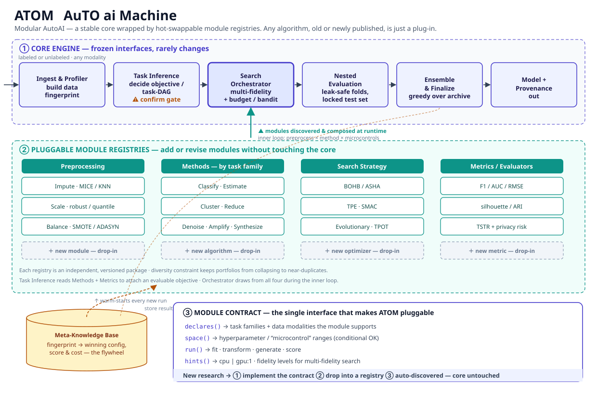

# ATOM — AuTO ai Machine

**ATOM** is a modular AutoAI platform: a stable, frozen core wrapped by hot-swappable
module registries. Any algorithm — classical or newly published — is just a plug-in.

ATOM is not a single application and not only an LLM wrapper. It is a platform for
**multi-modal AI machines**, covering:

- Traditional ML — classification, regression/estimation, clustering
- Deep learning and vision recognition / vision models
- Image data processing
- Data abstraction and dimensionality reduction
- Dataset amplification and synthesis (augmentation, generative)
- Denoising and signal cleanup
- Prediction / forecasting
- Generative AI and LLM-based components

The unifying idea: **new research should never require touching the core.**
Implement the module contract, drop the module into a registry, and it is
auto-discovered and composed at runtime.

---

## Architecture



ATOM has three layers:

### ① Core Engine — frozen interfaces, rarely changes

A fixed pipeline that accepts labeled or unlabeled data of any modality:

| Stage | Responsibility |
|---|---|
| **Ingest & Profiler** | Load data, build a data **fingerprint** (modality, shape, statistics, quality signals) |
| **Task Inference** | Decide the objective / task-DAG from the fingerprint — with a ⚠ user **confirm gate** |
| **Search Orchestrator** | The hub. Multi-fidelity search with budget / bandit control over the inner loop: `preprocess × method × microcontrols` |
| **Nested Evaluation** | Leak-safe folds, locked test set — honest scores only |
| **Ensemble & Finalize** | Greedy ensemble selection over the candidate archive |
| **Model + Provenance** | Export the final model plus a full provenance record of how it was found |

### ② Pluggable Module Registries — add or revise modules without touching the core

Four independent, versioned registries. The orchestrator discovers and composes
modules from all of them at runtime:

| Registry | Examples |
|---|---|
| **Preprocessing** | Impute (MICE / KNN), Scale (robust / quantile), Resample (SMOTE / ADASYN), filtering, augmentation, image transforms |
| **Methods** (by task family) | Classification · Regression (incl. temporal) · Clustering · Dimension reduction · Anomaly detection · Generative · Structured prediction · Association mining · Preference learning |
| **Search Strategy** | BOHB / ASHA, TPE, SMAC, Evolutionary / TPOT |
| **Metrics / Evaluators** | F1 / AUC / RMSE, silhouette / ARI, TSTR + privacy risk |

A **diversity constraint** keeps candidate portfolios from collapsing to
near-duplicates. Task Inference reads the Methods and Metrics registries to
attach an evaluable objective to every inferred task.

### ③ Module Contract — the single interface that makes ATOM pluggable

Every module, regardless of registry, implements four methods:

```python
class Module:
    def declares(self) -> Declaration:
        """Task families + data modalities this module supports."""

    def space(self) -> SearchSpace:
        """Hyperparameter / 'microcontrol' ranges (conditional OK)."""

    def run(self, ctx: RunContext) -> RunResult:
        """fit · transform · generate · score."""

    def hints(self) -> ResourceHints:
        """cpu | gpu:N · fidelity levels for multi-fidelity search."""
```

New research → ① implement the contract → ② drop into a registry →
③ auto-discovered. **Core untouched.**

### Meta-Knowledge Base — the flywheel

Every run stores `fingerprint → winning config, score & cost`. New runs are
**warm-started** from the nearest fingerprints, so ATOM gets faster and smarter
with every dataset it sees.

---

## Repository layout

```
atom/
└── docs/
    ├── architecture.md          # full architecture reference
    ├── design/                  # ADRs (decision records) + open questions
    └── diagrams/                # architecture diagrams
```

## Installation

```bash
bash scripts/setup.sh     # fresh machine: OS packages + ATOM + health check
                          #   macOS (brew), RHEL 10/Rocky/Alma/Fedora (dnf), Debian 13/Ubuntu (apt)
bash scripts/install.sh   # Python 3.10+ already present: per-user ATOM only (no root on Linux)
bash scripts/sample_run.sh  # sample end-to-end test after install
```

Self-contained under `~/atom` — sources, venv, config, data, runs, meta-KB.
Details: [`docs/install.md`](docs/install.md).

## Using the `atom` command

Full command manual (Linux + macOS): [`docs/manual.md`](docs/manual.md) —
every subcommand, flag, output, serving the ONNX model package, and recipes.
Running many datasets on a cluster: [`docs/slurm.md`](docs/slurm.md) (Slurm job
arrays + ready-to-run scripts in [`scripts/slurm/`](scripts/slurm/)).

```bash
atom pack mydata.csv --target label --out pkgs   # CSV -> ATOM Dataset Package
atom inspect pkgs/mydata                          # profile it
atom run pkgs/mydata --time-budget 120 --yes      # train -> deployable ONNX package
atom modules verify                               # health check
```

## Status

**Design phase complete (2026-07-14) — implementation starting.**
The architecture is specified in [`docs/architecture.md`](docs/architecture.md)
and settled in accepted decision records ADR-0001..0007 under
[`docs/design/`](docs/design/):

| ADR | Decision |
|---|---|
| 0001 | Module contract (`declares/space/run/hints`) |
| 0002 | Registries & drop-in discovery |
| 0003 | ATOM Dataset Package (ADP) — zip/folder, loose-input conversion, DMS-aligned |
| 0004 | ATOM Model Package (AMP) on ONNX — pipeline export, parity gate |
| 0005 | v1 scope: 9 task families, foundation (zero/few-shot, PEFT), lab-server operating model |
| 0006 | Budget: wall-clock primary, optional trial count, estimated end time |
| 0007 | Module promotion: benchmark gate → AI-assisted dossier → minimal human approval |

The method taxonomy lives in
[`docs/design/method-taxonomy.md`](docs/design/method-taxonomy.md);
the implementation plan in [`docs/roadmap.md`](docs/roadmap.md) (M1 skeleton
→ M2 tabular MVP on CIC-IDS-2017 → M3 ONNX model plane → M4 meta-KB
flywheel → M5 breadth/governance → M6 multi-modal & foundation).
